# Hey, I'm Sebastian

  

## 🧍🏾 About Me

- Informatics Engineering student
- Focused on cybersecurity, Linux hardening, and DevSecOps
- Daily driving openSUSE Tumbleweed with KDE Plasma on Wayland
- Currently building an IoT observability stack with Grafana as thesis project
- Working through the Jr Penetration Tester path on TryHackMe
- Exploring cloud security (GCP, Cloudflare, Azure) and AI security research

## 📈 GitHub Stats & Activity

## 🛠️ Technologies & Tools

### 🐧 Operating Systems & Infrastructure

### 🔧 Virtualization & Containerization

### 🔒 Security & Monitoring

### ⚙️ Infrastructure & Automation

### ☁️ Cloud & Networking

